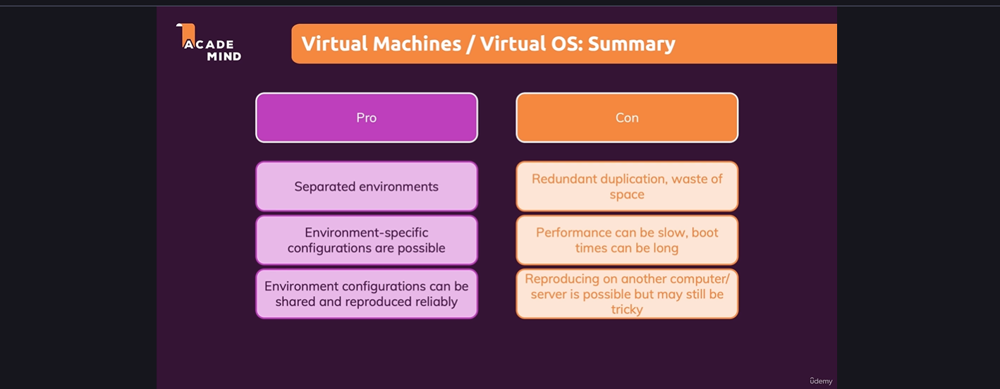
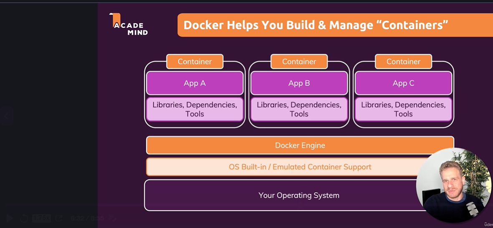

Docker 

Docker is a container technology: A tool for creating and managing containers.

container->A standard unit of software A package of code and dependencies to run that code.

the same container always yeilds the exact same application and execution behaviour.

why we need containers??

why would we want  independent, standadized "application packages"?

different developemnt and production environments.


due to diffrentiation in versions and dependencies it will work differently in differnt system to avoid this situation we need to use containarization so we can have same for everyone.


Docker and virtual machines??







docker commands:

docker
Usage:  docker [OPTIONS] COMMAND

A self-sufficient runtime for containers

Common Commands:
  run         Create and run a new container from an image
  exec        Execute a command in a running container
  ps          List containers
  build       Build an image from a Dockerfile
  bake        Build from a file
  pull        Download an image from a registry
  push        Upload an image to a registry
  images      List images
  login       Authenticate to a registry
  logout      Log out from a registry
  search      Search Docker Hub for images
  version     Show the Docker version information
  info        Display system-wide information

Management Commands:
  ai*         Docker AI Agent - Ask Gordon
  builder     Manage builds
  buildx*     Docker Buildx
  compose*    Docker Compose
  container   Manage containers
  context     Manage contexts
  debug*      Get a shell into any image or container
  desktop*    Docker Desktop commands
  extension*  Manages Docker extensions
  image       Manage images
  init*       Creates Docker-related starter files for your project
  manifest    Manage Docker image manifests and manifest lists
  mcp*        Docker MCP Plugin
  model*      Docker Model Runner
  network     Manage networks
  offload*    Docker Offload
  plugin      Manage plugins
  sandbox*    Docker Sandbox
  sbom*       View the packaged-based Software Bill Of Materials (SBOM) for an image
  scout*      Docker Scout
  system      Manage Docker
  volume      Manage volumes

Swarm Commands:
  swarm       Manage Swarm

Commands:
  attach      Attach local standard input, output, and error streams to a running container
  commit      Create a new image from a container's changes
  cp          Copy files/folders between a container and the local filesystem
  create      Create a new container
  diff        Inspect changes to files or directories on a container's filesystem
  events      Get real time events from the server
  export      Export a container's filesystem as a tar archive
  history     Show the history of an image
  import      Import the contents from a tarball to create a filesystem image
  inspect     Return low-level information on Docker objects
  kill        Kill one or more running containers
  load        Load an image from a tar archive or STDIN
  logs        Fetch the logs of a container
  pause       Pause all processes within one or more containers
  port        List port mappings or a specific mapping for the container
  rename      Rename a container
  restart     Restart one or more containers
  rm          Remove one or more containers
  rmi         Remove one or more images
  save        Save one or more images to a tar archive (streamed to STDOUT by default)
  start       Start one or more stopped containers
  stats       Display a live stream of container(s) resource usage statistics
  stop        Stop one or more running containers
  tag         Create a tag TARGET_IMAGE that refers to SOURCE_IMAGE
  top         Display the running processes of a container
  unpause     Unpause all processes within one or more containers
  update      Update configuration of one or more containers
  wait        Block until one or more containers stop, then print their exit codes

Global Options:
      --config string      Location of client config files (default
                           "C:\\Users\\Sandeep\\.docker")
  -c, --context string     Name of the context to use to connect to the
                           daemon (overrides DOCKER_HOST env var and
                           default context set with "docker context use")
  -D, --debug              Enable debug mode
  -H, --host string        Daemon socket to connect to
  -l, --log-level string   Set the logging level ("debug", "info",
                           "warn", "error", "fatal") (default "info")
      --tls                Use TLS; implied by --tlsverify
      --tlscacert string   Trust certs signed only by this CA (default
                           "C:\\Users\\Sandeep\\.docker\\ca.pem")
      --tlscert string     Path to TLS certificate file (default
                           "C:\\Users\\Sandeep\\.docker\\cert.pem")
      --tlskey string      Path to TLS key file (default
                           "C:\\Users\\Sandeep\\.docker\\key.pem")
      --tlsverify          Use TLS and verify the remote
  -v, --version            Print version information and quit

Run 'docker COMMAND --help' for more information on a command.

For more help on how to use Docker, head to https://docs.docker.com/go/guides/


create a docker file:
```docker

FROM node:20

WORKDIR /app

COPY package.json .

RUN npm install


COPY . .

EXPOSE 3000

CMD [ "node","app.js" ]
```
build doker file:

```powershell
doker build -t myapp
```

if any changes build the docker file again:

```powershell
doker build -t myapp
```


run the doker file in the port:

```powershell
docker run -p 3000:3000 imageId

```


to check all the running containers:

```powershell

docker ps

```

to stop the container:

```
docker stop pedantic_khorana

```
