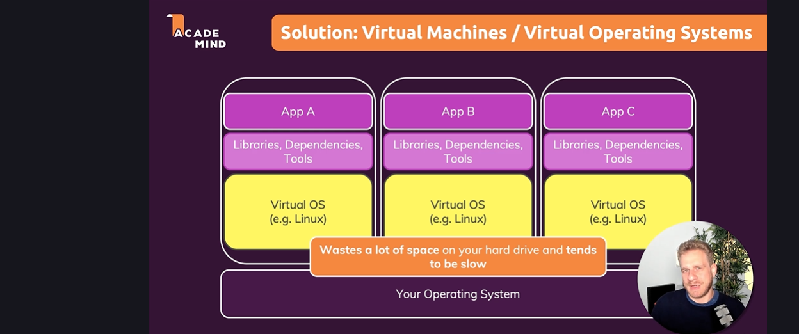

Docker 

Docker is a container technology: A tool for creating and managing containers.

container->A standard unit of software A package of code and dependencies to run that code.

the same container always yeilds the exact same application and execution behaviour.

why we need containers??

why would we want  independent, standadized "application packages"?

different developemnt and production environments.

due to diffrentiation in versions and dependencies it will work differently in differnt system to avoid this situation we need to use containarization so we can have same for everyone.

Docker and virtual machines??

