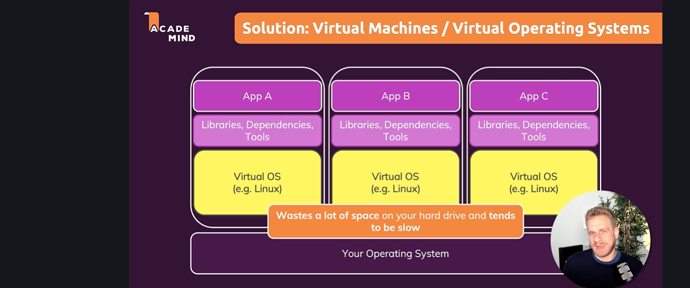
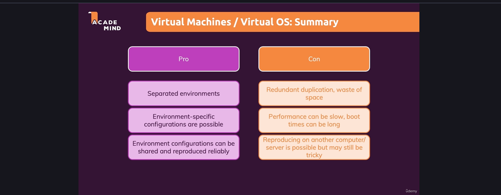
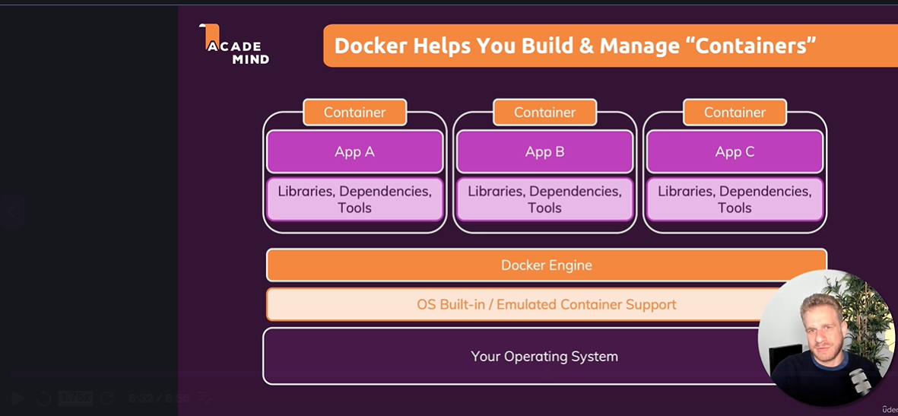
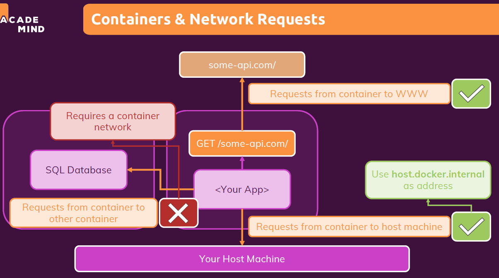
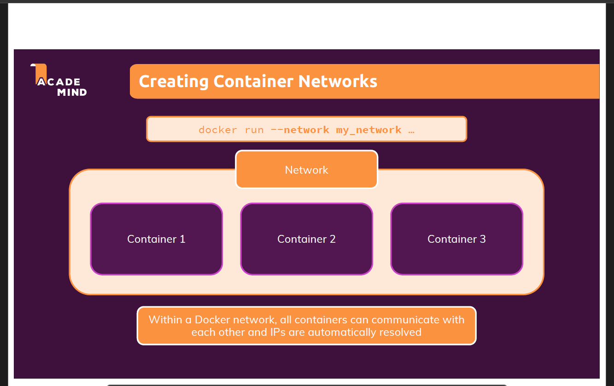
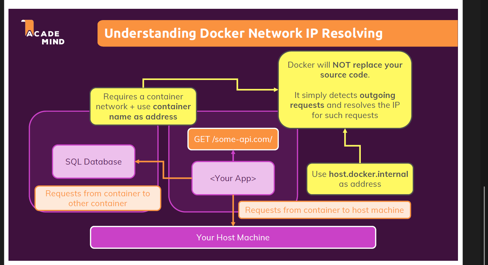

Docker 

Docker is a container technology: A tool for creating and managing containers.

container->A standard unit of software A package of code and dependencies to run that code.

the same container always yeilds the exact same application and execution behaviour.

why we need containers??

why would we want  independent, standadized "application packages"?

different developemnt and production environments.


due to diffrentiation in versions and dependencies it will work differently in differnt system to avoid this situation we need to use containarization so we can have same for everyone.


Docker and virtual machines??








docker commands:

docker
Usage:  docker [OPTIONS] COMMAND

A self-sufficient runtime for containers

Common Commands:
  run         Create and run a new container from an image
  exec        Execute a command in a running container
  ps          List containers
  build       Build an image from a Dockerfile
  bake        Build from a file
  pull        Download an image from a registry
  push        Upload an image to a registry
  images      List images
  login       Authenticate to a registry
  logout      Log out from a registry
  search      Search Docker Hub for images
  version     Show the Docker version information
  info        Display system-wide information

Management Commands:
  ai*         Docker AI Agent - Ask Gordon
  builder     Manage builds
  buildx*     Docker Buildx
  compose*    Docker Compose
  container   Manage containers
  context     Manage contexts
  debug*      Get a shell into any image or container
  desktop*    Docker Desktop commands
  extension*  Manages Docker extensions
  image       Manage images
  init*       Creates Docker-related starter files for your project
  manifest    Manage Docker image manifests and manifest lists
  mcp*        Docker MCP Plugin
  model*      Docker Model Runner
  network     Manage networks
  offload*    Docker Offload
  plugin      Manage plugins
  sandbox*    Docker Sandbox
  sbom*       View the packaged-based Software Bill Of Materials (SBOM) for an image
  scout*      Docker Scout
  system      Manage Docker
  volume      Manage volumes

Swarm Commands:
  swarm       Manage Swarm

Commands:
  attach      Attach local standard input, output, and error streams to a running container
  commit      Create a new image from a container's changes
  cp          Copy files/folders between a container and the local filesystem
  create      Create a new container
  diff        Inspect changes to files or directories on a container's filesystem
  events      Get real time events from the server
  export      Export a container's filesystem as a tar archive
  history     Show the history of an image
  import      Import the contents from a tarball to create a filesystem image
  inspect     Return low-level information on Docker objects
  kill        Kill one or more running containers
  load        Load an image from a tar archive or STDIN
  logs        Fetch the logs of a container
  pause       Pause all processes within one or more containers
  port        List port mappings or a specific mapping for the container
  rename      Rename a container
  restart     Restart one or more containers
  rm          Remove one or more containers
  rmi         Remove one or more images
  save        Save one or more images to a tar archive (streamed to STDOUT by default)
  start       Start one or more stopped containers
  stats       Display a live stream of container(s) resource usage statistics
  stop        Stop one or more running containers
  tag         Create a tag TARGET_IMAGE that refers to SOURCE_IMAGE
  top         Display the running processes of a container
  unpause     Unpause all processes within one or more containers
  update      Update configuration of one or more containers
  wait        Block until one or more containers stop, then print their exit codes

Global Options:
      --config string      Location of client config files (default
                           "C:\\Users\\Sandeep\\.docker")
  -c, --context string     Name of the context to use to connect to the
                           daemon (overrides DOCKER_HOST env var and
                           default context set with "docker context use")
  -D, --debug              Enable debug mode
  -H, --host string        Daemon socket to connect to
  -l, --log-level string   Set the logging level ("debug", "info",
                           "warn", "error", "fatal") (default "info")
      --tls                Use TLS; implied by --tlsverify
      --tlscacert string   Trust certs signed only by this CA (default
                           "C:\\Users\\Sandeep\\.docker\\ca.pem")
      --tlscert string     Path to TLS certificate file (default
                           "C:\\Users\\Sandeep\\.docker\\cert.pem")
      --tlskey string      Path to TLS key file (default
                           "C:\\Users\\Sandeep\\.docker\\key.pem")
      --tlsverify          Use TLS and verify the remote
  -v, --version            Print version information and quit

Run 'docker COMMAND --help' for more information on a command.

For more help on how to use Docker, head to https://docs.docker.com/go/guides/


create a docker file:
```docker

FROM node:20

WORKDIR /app

COPY package.json .

RUN npm install


COPY . .

EXPOSE 3000

CMD [ "node","app.js" ]
```
build doker file:

```powershell
doker build -t myapp
```

if any changes build the docker file again:

```powershell
doker build -t myapp .
```


run the doker file in the port:

```powershell
docker run -p 3000:3000 imageId

```


to check all the running containers:

```powershell

docker ps

```

to stop the container:

```
docker stop pedantic_khorana

```

It will create a new node container

```
docker run node
```

To expose an interactive session from inside the container:
where we can use node js from the container.

```
docker run -it node
```

Docker follows layer based approach. when we rebuild the images with some changes in code where it will only change the layer that got updated. From that layer it will update each and every layer.


running existing container:

but when we running this command our frontend works but here the terminal wont get struck.

```
docker start "container name" 
```

Understanding atttached and detached containers:

in attach mode where we can see logs in the terminal.

In Detach mode we cant see it but in backgroud the docker container will be running.

Docker logs:

to read the docker logs:

```
docker logs "container name"
```

interative mode:

where by when we use some thing like input statements like int(input()) like that terminal need to take the input from our container so inorder to do that we have a command like:

```
docker run -it "container name"
```

Deleting container:

```
docker rm "container name"
```

docker images:

```
docket images
```

docket removing images:


```

docker rmi "imagename"

```

to remove all container once:

```
docker container prune
```


Copying a Files into and from a container:

It will copy file from local folder to a container.

```

docker cp dummy/. 5ff3acbf9a7fbbbe5e8805241254eea0c8b82511c2cdeaaac35906fd16613ce2:/test  
```

where we can do viseversa like copying file from contianer to local machine.


```
 docker cp 5ff3acbf9a7fbbbe5e8805241254eea0c8b82511c2cdeaaac35906fd16613ce2:/test/. dummy 
```


Naming and tagging images and containers:

To change the tag of the Image:

```
docker tag <Image Id > <Tag ID>

```

To change the tag of the container:

```
docker run -p 3000:3000 --rm --name  goalcontainer goalapp                  

```


Pushing images to docker hub:


1.where We need to share the images in two ways one is to sharing the image code so that they will use the same docker file and build.
2. Sharing the images with docker hub or any private repositories where docker can share images.


steps:
1. create a docker account.
2. create a new repository.
3. login to docker in the terminal

```
docker login
```

4. push the code in docker hub.

```
docker push acadamic/node-hello-world

docker push <new repo name>: <tagname>
```

# pullling the images:

1. where any one call pull the public images.

2. to pull the image:

```
docker pull acadamic/node-hello-world

```

3. to run it.

```
docker run -p 8000:8000 --rm  acadamic/node-hello-world
```

# Docker Volumes:

Docker volumes are used to persist data outside containers.

Why? Because containers are temporary. If you delete a container, all its internal data is lost unless you store it in a volume.

Think of it like this 🧠:

```
Container (temporary)
        |
        | writes data
        ↓
Docker Volume (permanent storage)

```

📦 What is a Docker Volume?

A Docker volume is a storage area managed by Docker to store container data.

Without volume:

```
Container → data deleted when container removed
```

With volume:

```
Container → Volume → Data survives container deletion
```

🛠️ Create a Volume

```
docker volume create myvolume
```

```
docker volume ls
```

Example output:

DRIVER    VOLUME NAME
local     myvolume

▶️ Use Volume With Container

```
docker run -d \
-p 3000:3000 \
-v myvolume:/app/data \
myimage
```

Explanation:

```
-v myvolume:/app/data
```

means:

```
Docker Volume  → Container Folder
myvolume       → /app/data
```

Any files written to /app/data will be saved in the volume.


📂 Example

Container writes file:


```
/app/data/users.json
```

Even if container stops:

```

docker rm container
```

The file still exists inside the volume.

When you run container again with same volume:

```
-v myvolume:/app/data
```

The data comes back.

🔎 Inspect Volume

```
docker volume inspect myvolume
```


Shows the physical storage location.


```
/var/lib/docker/volumes/myvolume/_data
```

🧹 Remove Volume

Delete one:

```
docker volume rm myvolume
```

Delete unused volumes:

```
docker volume prune
```


🧠 Think Like This
1️⃣ Docker Volume

Storage location is managed by Docker.
```
Container
   ↓
Docker Volume
   ↓
/var/lib/docker/volumes/...
```
Example:
```
docker run -v myvolume:/app/data myimage
```
Here:
```
myvolume  → Docker storage
/app/data → container folder
```

Data is stored inside Docker's internal directory.

📂 2️⃣ Bind Mount


```
Storage location is your system folder.

Container
   ↓
Host Folder (your laptop)

```

Example:

```
docker run -v $(pwd):/app myimage
```

Meaning:
```
Your Current Folder → /app inside container

```

If container writes:
```
/app/users.json
```

It will appear in your computer folder:

project/users.json
🔍 Visual Comparison
Volume

```
Container
   ↓
Docker Volume
   ↓
Docker Storage

```

Bind Mount

```
Container
   ↓
Your Local Folder

```

⚡ Example

Your folder:
```
project/
  index.js
```
Run:

```
docker run -v $(pwd):/app nodeapp
```

If container creates:

```
/app/log.txt
```

Your computer gets:

```
project/log.txt
```

| Feature                | Bind Mount           | Volume          |
| ---------------------- | -------------------- | --------------- |
| Storage location       | Your computer folder | Docker storage  |
| Used for               | Development          | Production data |
| Code updates instantly | ✔ Yes                | ❌ No            |
| Managed by Docker      | ❌ No                 | ✔ Yes           |


Example .dockerignore

Create a file called:
```
.dockerignore
```


```
node_modules
.git
.gitignore
Dockerfile
.dockerignore
npm-debug.log
.env
dist
build
```


project/
 ├── Dockerfile
 ├── .dockerignore
 ├── package.json
 ├── node_modules/
 └── index.js


 When Docker builds:

docker build -t myapp .

Docker ignores node_modules.

Instead Docker installs dependencies inside container.

Typical Node.js .dockerignore

```
node_modules
npm-debug.log
Dockerfile
.dockerignore
.git
.gitignore
.env
```

Setting Environment Variables in Docker

There are 3 common ways.

Method 1️⃣ ENV inside Dockerfile

In your Dockerfile:
```
ENV PORT=3000
ENV NODE_ENV=production
```

```
FROM node:18

WORKDIR /app

COPY package.json .

RUN npm install

COPY . .

ENV PORT=3000

CMD ["node","index.js"]
```

Now inside Node app:
```

process.env.PORT
```

Method 2️⃣ Pass ENV while running container

You can set variables when running container.
```

docker run -e PORT=4000 myapp
```

Example:
```

docker run -p 4000:4000 -e PORT=4000 myapp
```

Inside app:

process.env.PORT

Value = 4000

Method 3️⃣ .env file (Most common)

Create .env file:

```
PORT=5000
DB_URL=mongodb://mongo:27017/app
API_KEY=12345
```

Run container:
```
docker run --env-file .env myapp
```

Docker loads all variables.

Example Node App
```
const express = require("express")
const app = express()

const PORT = process.env.PORT || 3000

app.get("/", (req,res)=>{
    res.send("Server running")
})

app.listen(PORT,()=>{
    console.log("Running on",PORT)
})
```
🧠 Important Note

Never put secrets directly in Dockerfile:
```
ENV API_KEY=123456
```

Because Docker images are publicly inspectable.

Better:
```
.env
```
or

docker secrets (production)
🚀 Typical Docker Setup (Node Project)

.dockerignore
```
node_modules
.git
.env
```
.env

```
PORT=3000
MONGO_URL=mongodb://mongo:27017/app
```
Run

```
docker run --env-file .env myapp
```
Docker networks - Multiple containers:









1️⃣ Why Docker Networks Are Needed

Imagine you have two containers:

Node API
MongoDB

Node must connect to MongoDB.

Without networking they cannot communicate.

Docker networks allow containers to talk to each other using container names.

🧠 Architecture Example
```
User
 ↓
Node Container
 ↓
Mongo Container
```

Inside Node:
```

mongodb://mongo:27017/mydb
```

Notice mongo is the container name.

2️⃣ Create a Docker Network

Create a custom network:

docker network create mynetwork

Check networks:
```
docker network ls
```

Example output:
```

NETWORK ID     NAME
abc123         bridge
def456         mynetwork
```

3️⃣ Run MongoDB Container

```
docker run -d \
--name mongo \
--network mynetwork \
-v mongo-data:/data/db \
mongo
```

Explanation:

Option	Meaning
--name mongo	container name
--network mynetwork	attach to network
-v mongo-data:/data/db	persistent database storage

Now MongoDB is accessible as:
```
mongo:27017
```

inside the network.

4️⃣ Run Node Container

Now start Node container on the same network.
```
docker run -d \
--name nodeapp \
--network mynetwork \
-p 3000:3000 \
nodeapp
```

Now both containers are connected.

5️⃣ Node App Connection Example

Inside your Node app:
```
const mongoose = require("mongoose")

mongoose.connect("mongodb://mongo:27017/mydb")
.then(()=> console.log("Mongo connected"))
.catch(err => console.log(err))
```
Important part:

mongo

That is the Mongo container name.

Docker DNS automatically resolves it.
```
🧠 Network Visualization
           Docker Network
             mynetwork
        ┌─────────┬─────────┐
        │         │         │
     NodeApp    MongoDB   (other containers)
        │         │
        └──────communication──────┘
```
Containers can talk using container names as hostnames.

6️⃣ Inspect Network

See connected containers:

docker network inspect mynetwork

Example:

Containers:
   mongo
   nodeapp
7️⃣ Multiple Containers Example

Let’s add Redis too.
```
docker run -d \
--name redis \
--network mynetwork \
redis
```

Network now:
```
mynetwork
   │
   ├── Node Container
   ├── Mongo Container
   └── Redis Container
```
Node can access:
```
mongo:27017
redis:6379
```

8️⃣ Multiple Networks Example

Sometimes containers should not all talk to each other.

Example architecture:

Frontend → Backend → Database

We create two networks.
```
Create Networks
docker network create frontend-net
docker network create backend-net
Run Mongo (backend network)
docker run -d \
--name mongo \
--network backend-net \
mongo
Run Backend (both networks)
docker run -d \
--name backend \
--network backend-net \
nodeapp
```

Then connect backend to frontend network:

docker network connect frontend-net backend
```
Run Frontend
docker run -d \
--name frontend \
--network frontend-net \
```
reactapp
🧠 Final Architecture
```
Frontend Network
     │
  React App
     │
  Backend API
     │
Backend Network
     │
   MongoDB
   ```

Frontend cannot directly access MongoDB.

This improves security.

9️⃣ List Networks
```
docker network ls
```
🔟 Remove Network
```
docker network rm mynetwork
```
(Containers must be stopped first)

🚀 Real Projects Usually Use Docker Compose

Instead of writing many docker run commands.

Example docker-compose.yml:
```

version: "3"

services:
  nodeapp:
    build: .
    ports:
      - "3000:3000"
    depends_on:
      - mongo

  mongo:
    image: mongo
    volumes:
      - mongo-data:/data/db

volumes:
  mongo-data:
```
Run everything:

docker compose up

Docker automatically creates a network for all services.